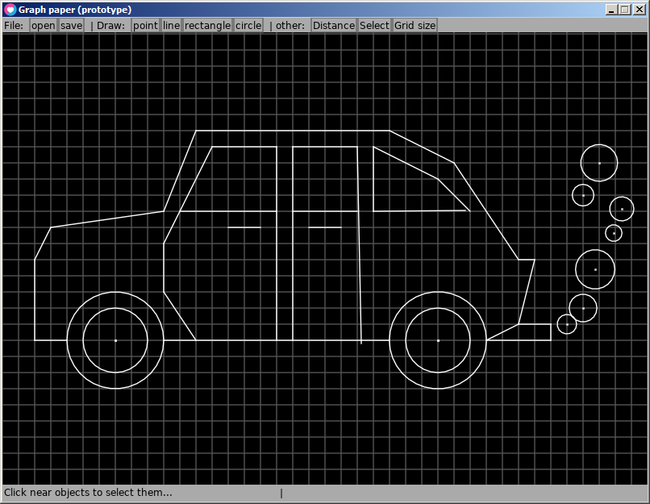

# graph-paper

simple vector editor / language / CAD for primitive technology

**Work in progress.** Not yet usable in real life.

## idea and motivation

There is no intuitive CAD aimed at hobbyists. Idea is having something like virtual equivalent of good old graph paper. Click on one crossing get point A, on another and get point B and voila - you have your first line segment!

## status

I have working prototype running in LOVE 2D engine. Download this repository as ZIP file and rename it as `graph-paper.love`.

## TODO

- drawing object of specified size (implemented just for lines now)

### later

- intersections
- cutting objects
- zooming and moving
- export to SVG
- import from SVG (maybe using [svglover](https://github.com/globalcitizen/svglover))
- import from GeoJSON
- undo and redo
- drawing circle arcs
- styling of drawing
- symbols
- text
- grouping objects
- export for print