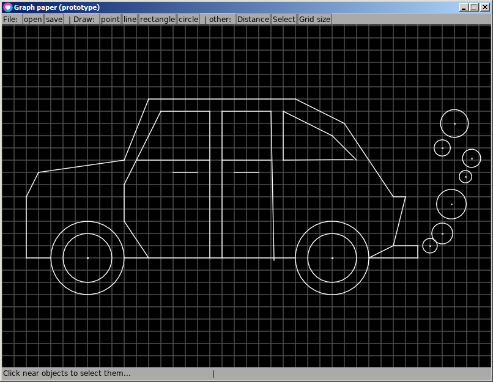

# graph-paper

simple vector editor / language / CAD for primitive technology

**Work in progress.** Not yet usable in real life.

## idea and motivation

There is no intuitive CAD aimed at hobbyists. Idea is having something like virtual equivalent of good old graph paper. Click on one crossing get point A, on another and get point B and voila - you have your first line segment!

## status

I have working prototype running in LÖVE game engine which looks like this:

It's not possible to zoom and move in it and it will be eventually replaced by browser-based version.

There is also simple (text based) editor which you can [use in browser](https://severak.github.io/graph-paper/).

Both editors use [custom file format](doc/file-format.md).

In this repository there is also [unit library](https://github.com/severak/graph-paper/blob/main/severak/units.lua) (documented [here](severak/units.md)) which is however not actually used in this project.

## wanted functionality

- intersections
- cutting objects
- zooming and moving
- export to SVG, DXF
- import from SVG, DXF, GeoJSON
- undo and redo
- drawing circle arcs
- styling of drawing
- symbols
- text
- grouping objects
- export for print